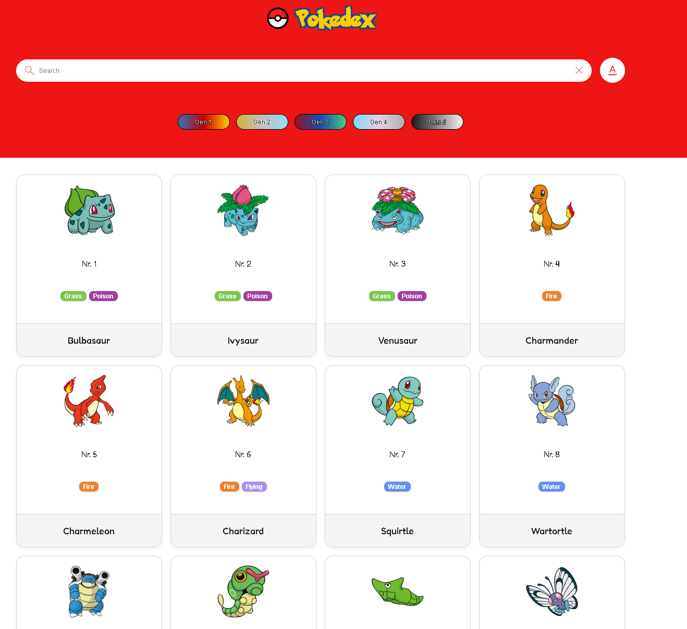

# 🔴 Pokédex

**A responsive Pokédex web application built with vanilla JavaScript and the PokéAPI.**

Explore Pokémon from the first five generations, search by name or Pokédex number and open detailed views containing abilities, base stats and evolution chains. The application loads its data dynamically from the PokéAPI and presents each Pokémon with type-based colors and artwork.

## ▶️ View live

**[Open the Pokédex live demo](https://tobiasillner.developerakademie.net/pokedex/index.html)**

## 🖼️ Project preview



## 📖 About the project

This Pokédex is an interactive web application for browsing Pokémon and viewing detailed information about them. Pokémon are loaded dynamically from an external REST API and displayed as responsive cards with their number, name, artwork and types.

Users can switch between the first five Pokémon generations, search for individual Pokémon and open a detailed view. The detail dialog includes general information, visual base-stat bars and the Pokémon's evolution chain.

The project was created during my further training as a Fullstack Developer at the **Developer Akademie**. It focuses on asynchronous JavaScript, REST API integration, dynamic DOM rendering and responsive interface design.

## ✨ Features

- 🔎 Search for Pokémon by name or Pokédex number
- 🔢 Search-mode selection for names and numbers
- 🧬 Browse Pokémon from generations 1 through 5
- 🃏 Responsive card layout with Pokémon artwork, number, name and types
- 🎨 Type-specific colors, badges and detail backgrounds
- ➕ Incremental loading of 20 additional Pokémon
- 📋 Detailed Pokémon dialog
- 📏 Height, weight, base experience and ability information
- 📊 Visual base-stat bars
- 🔄 Dynamically loaded evolution chains
- ⬅️➡️ Navigation between previous and next Pokémon
- 🔁 Continuous navigation from the end of the active list back to the beginning
- ⏳ Loading animation during API requests
- ❌ Clearable search input and visible no-result feedback
- 📱 Responsive layout for desktop, tablet and mobile devices

## 🧭 How to use

1. Select one of the five generation buttons to load its Pokémon.
2. Use the search field to find a Pokémon:
   - Select **Name** and enter at least three characters.
   - Select **Number** and enter a Pokédex number.
3. Select a Pokémon card to open its detailed view.
4. Switch between the **Infos**, **Stats** and **Evolution** tabs.
5. Use the arrow buttons to navigate through the currently active Pokémon list.
6. Select **Load more** to display the next group of Pokémon.

## 🛠️ Tech stack

- **HTML5** for the semantic application structure
- **CSS3** for the interface, animations and responsive layouts
- **Vanilla JavaScript** for application logic and DOM manipulation
- **Fetch API** for asynchronous HTTP requests
- **Async/Await** for handling API operations
- **PokéAPI** as the external Pokémon data source
- **Native HTML Dialog API** for the detailed Pokémon view
- **CSS Grid and Flexbox** for responsive layouts
- **CSS custom properties** for reusable theme colors

No package manager, framework or build process is required.

## 🧠 Application flow

```text
PokéAPI
   │
   ├── Pokémon list
   │      └── Responsive Pokémon cards
   │             ├── Artwork
   │             ├── Pokédex number
   │             ├── Name
   │             └── Types
   │
   └── Pokémon details
          ├── General information
          ├── Base statistics
          └── Evolution chain
```

The application separates reusable HTML templates from data-loading and interaction logic:

- `script.js` handles API requests, searching, generation selection, incremental loading and dialog interactions
- `assets/javascript/template.js` contains reusable templates for cards, types, details, stats and evolutions
- `style.css` controls the main layout, cards, dialogs, animations and responsive behavior
- `assets/css/` contains shared variables, fonts and base styles

## 📁 Project structure

```text
pokedex/
├── index.html                    # Application structure and entry point
├── script.js                     # API requests and application logic
├── style.css                     # Main component and responsive styles
├── assets/
│   ├── pokedex-projekt.png       # Project preview
│   ├── css/
│   │   ├── fonts.css             # Local font definitions
│   │   ├── standard.css          # Shared base styles
│   │   └── variable.css          # Theme and game colors
│   ├── fonts/                    # Local Fredoka font files
│   ├── icons/                    # Interface and navigation icons
│   ├── javascript/
│   │   └── template.js           # Reusable HTML templates
│   └── pokemon-icons/            # Icons for all Pokémon types
└── .vscode/
    └── settings.json             # Local editor configuration
```

## 🚀 Getting started

The project consists of static HTML, CSS and JavaScript files, so no installation or build step is needed.

1. Clone the repository:

   ```bash
   git clone https://github.com/TobiasIllnerDev/pokedex.git
   ```

2. Open the project directory:

   ```bash
   cd pokedex
   ```

3. Start the application with a local development server.

For example, use the **Live Server** extension in Visual Studio Code and open `index.html`. An internet connection is required because Pokémon data and artwork are loaded from external services.

## 💡 What I learned

This project provided practical experience with:

- Fetching and processing data from a REST API
- Working with asynchronous JavaScript and `async`/`await`
- Rendering API data dynamically in the DOM
- Splitting UI markup into reusable template functions
- Searching and filtering data based on user input
- Implementing incremental loading for larger datasets
- Combining data from multiple related API endpoints
- Creating dynamic detail views with the native Dialog API
- Visualizing numerical data with stat bars
- Navigating through filtered and generation-specific datasets
- Building responsive card grids and dialogs
- Handling loading, empty and error states

## 👤 Author

Created by **Tobias Illner** as a portfolio project during further training as a Fullstack Developer at the **Developer Akademie**.

- GitHub: [@TobiasIllnerDev](https://github.com/TobiasIllnerDev)

## 📜 Credits

Pokémon data is provided by the [PokéAPI](https://pokeapi.co/). Pokémon artwork is loaded from the [PokéAPI sprites repository](https://github.com/PokeAPI/sprites).

This is a non-commercial educational portfolio project. Pokémon and all related names, characters and imagery are trademarks and intellectual property of their respective owners. This project is not affiliated with or endorsed by Nintendo, Game Freak or The Pokémon Company.
